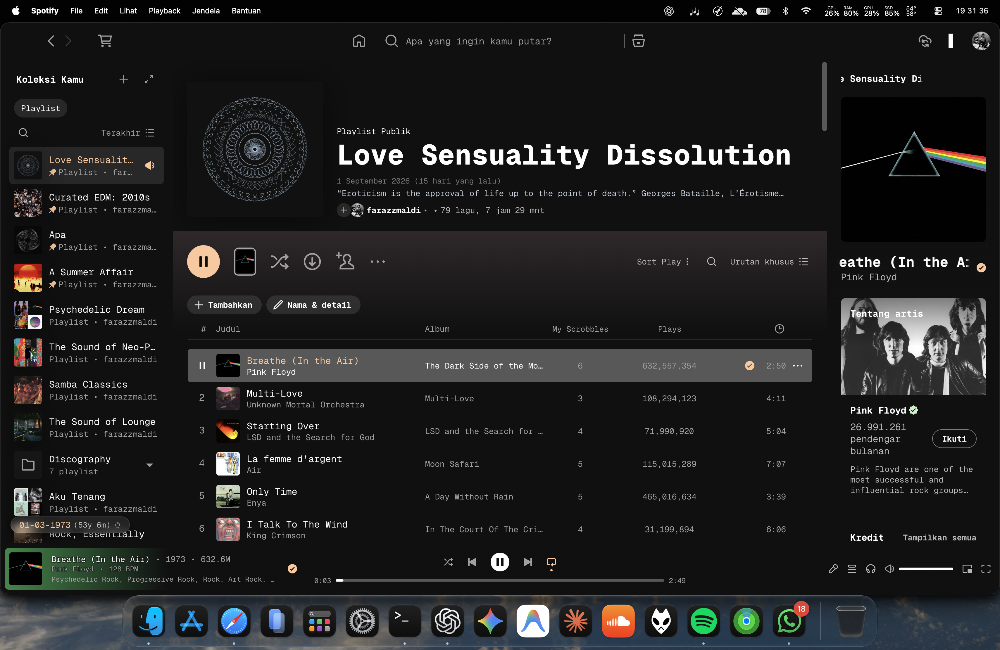

# Spicetify Playlist Age

A lightweight Spicetify extension that displays an estimated playlist creation date together with its precise calendar age.

## Preview



## Example

English version:

```text
21 April 2022 (4 years, 4 months, 26 days ago)
```

Indonesian version:

```text
21 April 2022 (4 tahun, 4 bulan, 26 hari yang lalu)
```

## How it works

Spotify does not expose an official playlist creation date.

Spicetify Playlist Age uses the oldest available `addedAt` timestamp from the playlist items as an estimate of when the playlist began.

Because of this, the displayed date may be newer than the actual playlist creation date if the earliest tracks were removed.

## Features

- Estimated playlist creation date
- Precise calendar age in years, months, and days
- Calendar-aware age calculation
- English and Indonesian variants
- Automatically updates when navigating between playlists
- Automatically refreshes the displayed age after midnight
- Runs locally inside the Spotify desktop client
- No API key required
- No analytics
- No tracking
- No external server

## Languages

Two language variants are included:

- `playlistCreatedDate.js` — English (default / Marketplace version)
- `playlistCreatedDate.id.js` — Indonesian

The English version is the default version used by the Spicetify Marketplace.

## Requirements

- Spotify Desktop
- Spicetify CLI

## Installation

### English

Copy:

```text
playlistCreatedDate.js
```

into:

```text
~/.config/spicetify/Extensions/
```

Then run:

```bash
spicetify config extensions playlistCreatedDate.js
spicetify apply
```

Restart Spotify.

### Indonesian

Copy:

```text
playlistCreatedDate.id.js
```

into:

```text
~/.config/spicetify/Extensions/
```

Then run:

```bash
spicetify config extensions playlistCreatedDate.id.js
spicetify apply
```

Restart Spotify.

Do not enable both language variants at the same time.

## Marketplace

The Marketplace version uses:

```text
playlistCreatedDate.js
```

which is the English version.

## Limitations

The displayed date is an estimate based on the oldest available playlist-item timestamp.

It is not an official Spotify playlist creation timestamp.

If older tracks were removed from the playlist, the displayed date may be later than the playlist's actual creation date.

The extension uses internal Spotify APIs exposed through Spicetify. These APIs may change between Spotify versions and could require compatibility updates.

## Privacy

Spicetify Playlist Age runs locally inside the Spotify desktop client.

The extension does not:

- collect personal data;
- transmit playlist data to external servers;
- use analytics;
- use tracking;
- store Spotify credentials.

## License

MIT License.

Copyright © 2026 Farazzmaldi.
